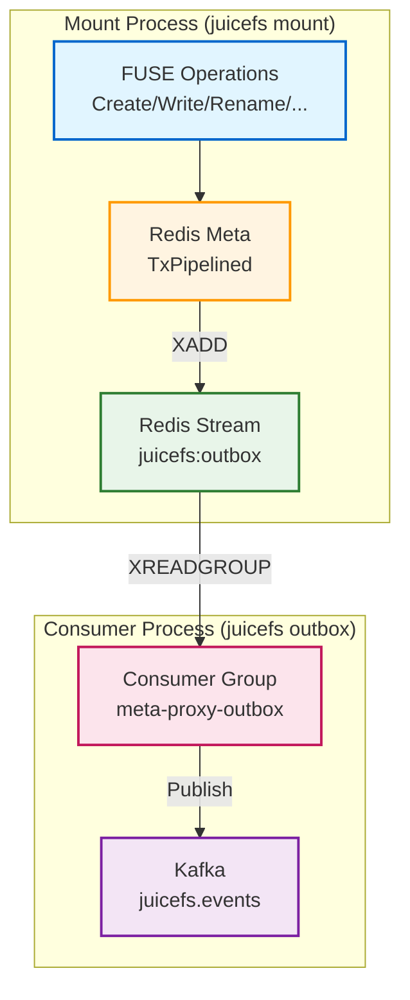

# JuiceFS Redis Streams Outbox Implementation

## Summary

Implemented a Redis Streams outbox pattern in JuiceFS to publish filesystem events to Kafka topic `juicefs.events`. This provides comprehensive event coverage including inode information and directory operations.

## Files Created

1. **pkg/meta/events.go** - Event types and `JuiceFsEvent` struct
2. **pkg/meta/outbox.go** - Redis Streams outbox with consumer group, retry logic, and dead-letter queue
3. **pkg/meta/watermill_kafka.go** - Kafka publisher using Watermill and Shopify/sarama
4. **pkg/meta/redis_event.go** - Event publishing helper functions for all filesystem operations
5. **cmd/outbox.go** - Standalone outbox command

## Files Modified

1. **pkg/meta/config.go** - Added `OutboxConfig` structure with defaults
2. **pkg/meta/redis.go** - Integrated event publishing into 6 meta operations (writes to Redis stream only)
3. **cmd/flags.go** - Added CLI flags for outbox configuration
4. **cmd/mount.go** - Parse outbox-enabled flag
5. **cmd/main.go** - Added outbox command
6. **go.mod** - Added Kafka dependencies

## Event Coverage

| Operation | Event Type | Function |
|-----------|-----------|----------|
| Create (file) | FileCreated | doMknod |
| Mkdir | DirCreated | doMknod |
| Rename | FileMoved | doRename |
| Unlink | FileDeleted | doUnlink |
| Rmdir | DirDeleted | doRmdir |
| Write | FileWritten | doWrite |
| Fallocate | FileWritten | doFallocate |

## CLI Flags

### Mount Command (writes events to Redis stream)

```bash
--outbox-enabled                  # Enable writing events to Redis stream
--outbox-stream juicefs:outbox      # Redis stream name (default: juicefs:outbox)
```

### Outbox Command (reads from stream and publishes to Kafka)

```bash
juicefs outbox REDIS-URL --kafka-brokers KAFKA-BROKERS [options]

Options:
   --outbox-stream juicefs:outbox    # Redis stream name (default: juicefs:outbox)
   --group meta-proxy-outbox       # Consumer group name (default: meta-proxy-outbox)
   --kafka-brokers kafka:9092      # Kafka brokers (required, comma-separated)
   --kafka-topic juicefs.events      # Kafka topic (default: juicefs.events)
   --kafka-user                    # Kafka SASL username for authentication
   --kafka-password                # Kafka SASL password for authentication
   --kafka-cert                    # Kafka TLS certificate (base64 encoded)
   --kafka-cert-file               # Path to Kafka TLS certificate file
   --kafka-insecure-skip-verify    # Skip TLS certificate verification
   --max-retries 10                # Max retry attempts (default: 10)
   --trim-max-len 10000            # Stream max length (default: 10000)
```

## Architecture



## Key Features

1. **Transactional**: Events added inside `TxPipelined` callbacks for atomicity with metadata operations
2. **Consumer Group**: Uses Redis consumer groups for reliable message processing
3. **Retry Logic**: Tracks retry counts, moves to dead-letter queue after 10 failures
4. **Bounded Stream**: XTRIM keeps stream under 10000 entries
5. **Context-Aware**: Extracts Uid/Gid from `Context` parameter

## Usage

### 1. Mount with outbox enabled (writes to Redis stream)

```bash
# Default stream name
juicefs mount --outbox-enabled redis://localhost /mnt/juicefs

# Custom stream name
juicefs mount --outbox-enabled --outbox-stream my-events redis://localhost /mnt/juicefs
```

### 2. Start outbox separately (reads from stream, publishes to Kafka)

```bash
# Basic usage
juicefs outbox redis://localhost \
  --kafka-brokers kafka:9092 \
  --kafka-topic juicefs.events

# With SASL authentication
juicefs outbox redis://localhost \
  --kafka-brokers kafka:9092 \
  --kafka-user myuser \
  --kafka-password mypassword

# With TLS certificate
juicefs outbox redis://localhost \
  --kafka-brokers kafka:9092 \
  --kafka-cert-file /etc/ssl/certs/ca.crt
```

### 3. Multiple consumers for high availability

```bash
# Consumer 1
juicefs outbox redis://localhost \
  --kafka-brokers kafka:9092 \
  --kafka-user myuser \
  --kafka-password mypassword \
  --group meta-proxy-outbox

# Consumer 2 (same group, load balanced)
juicefs outbox redis://localhost \
  --kafka-brokers kafka:9092 \
  --kafka-user myuser \
  --kafka-password mypassword \
  --group meta-proxy-outbox
```

## Build Verification

```bash
go build ./...  # ✅ Passes
go vet ./cmd/...  # ✅ Passes
```
